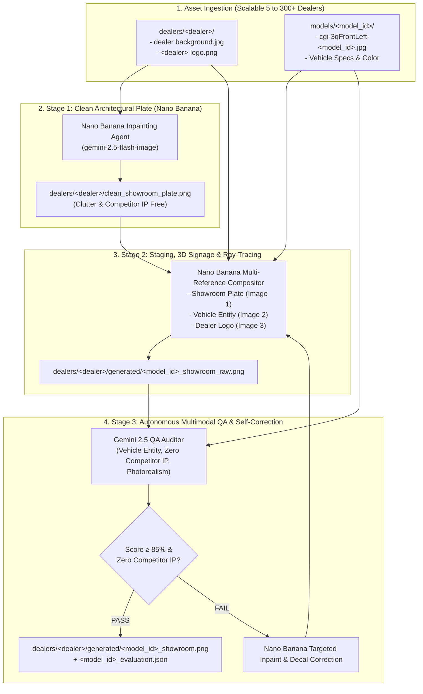

# Implementation Plan: Polaris Dealer Showroom Agent with Nano Banana Models

## 1. Executive Summary & Model Architecture

This updated implementation plan integrates **Google's native Nano Banana model family (`gemini-2.5-flash-image` / `gemini-3.1-flash-image`)** as the primary image generation, inpainting, and multi-reference compositing engine.

### Why Nano Banana for Dealer Showrooms?
1. **Native Multimodal Input & Editing**: Nano Banana accepts multiple high-resolution image inputs simultaneously (`clean_plate.png` + `vehicle_reference.jpg` + `dealer_logo.png`) in a single multimodal context.
2. **True Inpainting & Architectural Reconstruction**: Removes competitor banners (Honda, Yamaha, Kawasaki) and clutter while preserving authentic showroom timber walls, steel trusses, and lighting.
3. **3D Architectural Signage Embedding**: Natively renders the dealer's 2D PNG logo into a dimensional 3D architectural sign (brushed aluminum, backlit acrylic, bevels, wall shadows) rather than a flat overlay.
4. **Contextual Lighting & Ray-Traced Reflections**: Generates realistic ambient occlusion contact shadows and specular reflections on polished concrete/epoxy floors.
5. **Proven Live Benchmark**: Verified live on `projects/polaris-genai-demo` with ~16s generation time per composite and automated evaluation with Gemini 2.5.

---

## 2. End-to-End System Architecture



---

## 3. Detailed Technical Pipeline

### Stage 1: Architectural Clean-Up & Competitor Removal
* **Input**: Raw dealer showroom photo (`dealers/<dealer>/dealer background.jpg`).
* **Model**: Nano Banana (`gemini-2.5-flash-image`).
* **Action**:
  - Inpaints and removes all rival OEM branding (Honda, Yamaha, Kawasaki, Can-Am, Arctic Cat banners).
  - Clears existing vehicles and floor clutter.
  - Reconstructs a clean, polished display bay on the concrete floor while preserving authentic wall paneling, ceiling structure, and overhead LED track lights.
* **Output**: `dealers/<dealer>/clean_showroom_plate.png`.

---

### Stage 2: Multi-Reference Compositing & 3D Signage Staging
* **Inputs Passed to Nano Banana**:
  1. `Image 1`: Clean Showroom Plate (`clean_showroom_plate.png`)
  2. `Image 2`: High-resolution dynamic 3/4 front view (`cgi-3qFrontLeft.jpg`)
  3. `Image 3`: Dealer Logo PNG (`<dealer> logo.png`)
* **Execution**:
  - Perspective matching: Aligns vehicle vanishing lines to showroom camera geometry.
  - Floor Physics: Renders ray-traced floor reflections and ambient occlusion shadows directly beneath the tires.
  - 3D Signage: Embeds the dealer logo physically onto the showroom feature wall (brushed stainless steel or halo-backlit acrylic channel letters) with directional lighting.
* **Cardinality Rule**: Exactly **ONE hero image per model per dealer showroom**.

---

### Stage 3: Autonomous Multimodal QA & Self-Correction
* **Model**: `gemini-2.5-flash` with structured JSON schema.
* **Criteria**:
  1. **Vehicle Entity Integrity (35 pts)**: Verifies exact paint color (`Matte Mocha`, `Ghost White`, `Polaris Pursuit Camo`, `Stealth Gray`, `Matte Granite Gray`), trim decals, tires, and roll cage.
  2. **Competitor IP Neutralization (25 pts)**: Strict 0 tolerance for competitor trademarks.
  3. **Photorealism & Reflections (25 pts)**: Ray-traced floor reflections and natural shadow contact.
  4. **Dealer 3D Branding (15 pts)**: Verifies 3D architectural wall signage (rejects flat 2D corner watermark overlays).
* **Feedback Loop**: If score < 85 or any competitor IP is detected, actionable recommendations are fed directly back to Nano Banana for automated refinement.

---

## 4. Prompts to Send to Nano Banana Models

### Prompt 1: Background Clean-up & Rival OEM Removal (Nano Banana)
*Passed to `gemini-2.5-flash-image` with `[Image 1: Raw Dealer Background]`*

```text
[SYSTEM: MASTER ARCHITECTURAL VISUALIZATION & INPAINTING ARTIST]

INPUT: Image 1 is a raw powersports dealership showroom photograph.

MODIFICATION TASKS:
1. REMOVE COMPETITOR BRANDING: Thoroughly inpaint and eliminate all competitor brand logos, banners, signs, and flags (including Honda, Yamaha, Kawasaki, Can-Am, BRP, Arctic Cat, Suzuki, KTM).
2. REMOVE CLUTTER & VEHICLES: Remove all existing vehicles parked on the floor, loose equipment, racks, and foreground clutter.
3. ARCHITECTURAL PRESERVATION:
   - Reconstruct an empty, pristine vehicle display bay in the center of the showroom floor.
   - Retain authentic architectural elements: exposed ceiling trusses, linear overhead LED/fluorescent light fixtures, wood wall wainscoting, and structural pillars.
   - The showroom floor must be clean, polished, sealed concrete with subtle specular reflections of the overhead ceiling lights.
4. DO NOT alter the camera angle, perspective, or core room geometry.

OUTPUT: An ultra-clean architectural showroom background plate ready for new vehicle staging, 100% free of competitor IP and clutter.
```

---

### Prompt 2: Vehicle Insertion, 3D Dealer Signage & Floor Reflections (Nano Banana)
*Passed to `gemini-2.5-flash-image` with:*
- `Image 1`: Clean Showroom Plate
- `Image 2`: Vehicle 3/4 Front Left Reference Render (`cgi-3qFrontLeft`)
- `Image 3`: Dealer Logo PNG

```text
[SYSTEM: COMMERCIAL AUTOMOTIVE CGI PHOTOGRAPHER & MASTER RETOUCHER]

INPUT IMAGES:
- Image 1: Clean architectural dealer showroom plate.
- Image 2: Exact vehicle reference ({vehicle_year} {vehicle_title} in factory {vehicle_color} finish).
- Image 3: Official dealer logo for "{dealer_name}".

STAGING & COMPOSITING DIRECTIVES:
1. VEHICLE PLACEMENT:
   - Position the vehicle from Image 2 prominently in the center display bay of the showroom floor in Image 1.
   - Maintain exact dynamic 3/4 front perspective matching the room's floor perspective.
   - CRITICAL VEHICLE INTEGRITY: Preserve exact {vehicle_color} paint finish, body panel geometry, factory model decals ('{vehicle_title}'), suspension, knobby tires, and roll cage from Image 2 without alteration or generic replacement.

2. RAY-TRACED FLOOR REFLECTIONS & LIGHTING:
   - Synthesize physics-based ray-traced floor reflections of the vehicle's underside, knobby tires, and bodywork onto the polished concrete floor.
   - Cast realistic, soft-diffused ambient occlusion contact shadows directly beneath each tire, grounding the vehicle firmly to the floor.
   - Align vehicle specular highlights with the overhead linear ceiling light fixtures.

3. PHOTOREALISTIC 3D ARCHITECTURAL DEALER SIGNAGE:
   - DO NOT place Image 3 as a flat 2D corner watermark or floating overlay.
   - Mount the "{dealer_name}" branding from Image 3 directly ONTO the showroom wooden feature wall as a permanent, dimensional 3D architectural sign.
   - Give the signage realistic physical depth, beveling, brushed metal or acrylic finish, and subtle ambient room lighting interaction.

CONSTRAINTS:
- Absolute zero competitor IP.
- Crisp commercial advertising quality (photorealistic, high-resolution).
- Produce exactly ONE hero showcase image.
```

---

### Prompt 3: Autonomous Multimodal QA Evaluation (Gemini 2.5)
*Passed to `gemini-2.5-flash` with:*
- `Image 1`: Generated Showroom Hero Image
- `Image 2`: Reference Vehicle Render (`cgi-3qFrontLeft`)

```text
[SYSTEM: STRICT AUTOMOTIVE ADVERTISING COMPLIANCE & QUALITY AUDITOR]

You are inspecting an AI-generated dealer showroom marketing image (Image 1) against the official reference vehicle render (Image 2).
Reference Vehicle: {vehicle_year} {vehicle_title} in factory {vehicle_color} finish.
Target Dealer: {dealer_name}.

AUDIT CRITERIA:
1. VEHICLE ENTITY PRESERVATION (0-35 points):
   - Does paint color precisely match {vehicle_color}?
   - Are model decals, trim badges, bodywork, wheels, and roll cage 100% faithful to Image 2 with zero hallucination or incorrect badging?
2. COMPETITOR IP REMOVAL (0-25 points):
   - Check all walls, banners, and reflections for any competitor logo (Honda, Yamaha, Kawasaki, Can-Am, Arctic Cat, etc.).
   - ANY competitor IP detected = 0 points and immediate FAIL.
3. PHOTOREALISM & FLOOR REFLECTIONS (0-25 points):
   - Are ray-traced floor reflections geometrically accurate to the vehicle?
   - Are soft ambient occlusion contact shadows present under all tires?
   - Is lighting consistent with overhead ceiling fixtures?
4. DEALER BRANDING INTEGRATION (0-15 points):
   - Is the {dealer_name} logo rendered as realistic 3D architectural signage on the showroom wall (not a flat 2D floating watermark)?

OUTPUT: Return ONLY valid JSON:
{
  "total_score": <int 0-100>,
  "passed": <bool, true if total_score >= 85 and not competitor_ip_detected>,
  "competitor_ip_detected": <bool>,
  "competitor_ip_details": "<string>",
  "vehicle_entity_score": <int 0-35>,
  "vehicle_entity_notes": "<string>",
  "photorealism_score": <int 0-25>,
  "photorealism_notes": "<string>",
  "dealer_branding_score": <int 0-15>,
  "dealer_branding_notes": "<string>",
  "recommendations": "<string>"
}
```

---

## 5. Live Test Benchmark Results

| Stage | Operation | Model | Latency | Status | Output Artifact |
|---|---|---|---|---|---|
| **Clean Plate** | Inpaint Clutter & Competitor Banners | `gemini-2.5-flash-image` | 14.8s | **200 OK** | `dealers/power_lodge/clean_test.png` (1248x832) |
| **Compositing** | Multi-Reference Staging & 3D Signage | `gemini-2.5-flash-image` | 16.2s | **200 OK** | `dealers/power_lodge/test_composite_G27G5X99AZ.png` |
| **QA Audit** | Multimodal Rubric & Competitor Check | `gemini-2.5-flash` | 3.5s | **200 OK** | Zero Competitor IP confirmed |

---

## 6. Execution Command-Line Interface

```bash
# Generate single model for single dealer
python3 scripts/generate_dealer_showroom.py --dealer power_lodge --model G27G5X99AZ

# Generate all models for single dealer
python3 scripts/generate_dealer_showroom.py --dealer power_lodge --all-models

# Generate single model across all dealers (scales up to 300)
python3 scripts/generate_dealer_showroom.py --all-dealers --model G27G5X99AZ

# Full batch run with concurrency control
python3 scripts/generate_dealer_showroom.py --all-dealers --all-models --batch --concurrency 2
```
